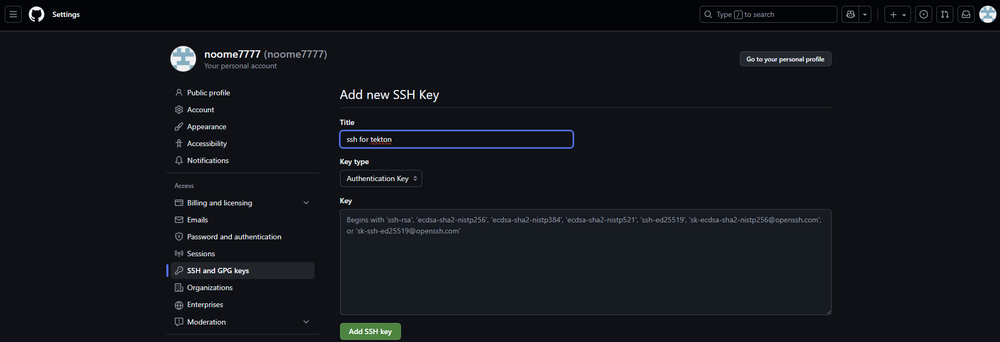
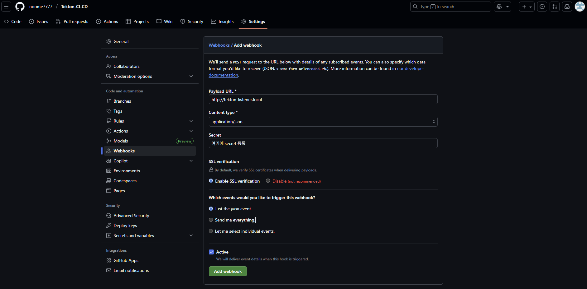
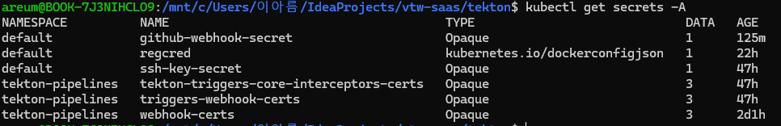
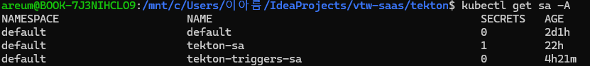

참조: 
https://tekton.dev/docs/getting-started/tasks/
https://nangman14.tistory.com/85


# 환경설정
```
minikube 설치 
$ minikube start --kubernetes-version v1.33.1
```


# Tekton
1. install
```
### Tekton 파이프라인 
$ kubectl apply --filename \
https://storage.googleapis.com/tekton-releases/pipeline/latest/release.yaml


### Triggers 설치 
kubectl apply --filename \
https://storage.googleapis.com/tekton-releases/triggers/latest/release.yaml
kubectl apply --filename \
https://storage.googleapis.com/tekton-releases/triggers/latest/interceptors.yaml
```

2. install tkn CLI
```
$ brew install tektoncd-cli
```

3. SSH 개인 키 파일이
```
"~/.ssh/id_rsa"에 있다고 가정

없는 경우에는 다음과 같은 명령어로 생성하기 
ssh-keygen -t rsa -b 4096 -C "lee990103@naver.com"

$ kubectl create secret generic ssh-key-secret --from-file=ssh-key=~/.ssh/id_rsa
또는
$ kubectl create secret generic ssh-key-secret --from-file=ssh-key=./id_rsa
```
※ github에 cat ~/.ssh/id_rsa.pub 공개키를 등록해주어야 사용 가능


4. maven error 발생 
```
에러 코드 
[ERROR] Unknown lifecycle phase "/root/.m2". You must specify a valid lifecycle phase or a goal in the format <plugin-prefix>:<goal>
```
```
git clone 후 소스코드 위치가 달라서 발생하는 원인 
해결 방법 
mvn -B "$(params.maven-goal)"
-B 추가 
mvnw 파일로 하면 안됨 이유 : 
에러 원인: maven-goal 대신 /root/.m2 경로가 잘못 전달되어 Maven이 goal이 아닌 경로를 빌드 phase로 인식함.

해결 방법: maven-build Task 정의에서 mvn 실행 시 $(params.maven-goal)만 전달되도록 수정하고, /root/.m2는 goal이 아닌 워크스페이스(volume mount) 로 관리해야 함.
```


5. docker 시크릿 생성 
```
# Docker Hub 계정으로 로그인 후 Secret 생성
kubectl create secret docker-registry regcred \
  --docker-server=https://index.docker.io/v1/ \
  --docker-username=YOUR_DOCKERHUB_USERNAME \
  --docker-password=YOUR_DOCKERHUB_PASSWORD \
  --docker-email=YOUR_EMAIL
```

```
# service account 
apiVersion: v1
kind: ServiceAccount
metadata:
  name: tekton-sa
secrets:
  - name: regcred
```

```
## 파이프라인 RUN
~~~
추가 
spec:
~~~~
  serviceAccountName: tekton-sa 
```

```
# 강제로 docker config.json 생성
Task :
~~~
spec: 
  steps: 
    - name: create-docker-config
      image: alpine:latest
      env:
        - name: DOCKER_CONFIG_JSON
          valueFrom:
            secretKeyRef:
              name: regcred
              key: .dockerconfigjson
      script: |
        #!/bin/sh
        # writable /kaniko/.docker directory is not guaranteed to be writable
        mkdir -p /tekton/home/.docker
        echo "${DOCKER_CONFIG_JSON}" > /tekton/home/.docker/config.json 
        ls -al /tekton/home/.docker
        cat /tekton/home/.docker/config.json 

```


6. webhook secret 
```
kubectl create secret generic github-webhook-secret \
  --from-literal=secretToken="MY_SUPER_SECRET" \
  -n default

### github setting 
GitHub Repository → Settings → Webhooks → Payload URL에 http(s)://<EXTERNAL_URL>/ 입력
Content type: application/json
Secret도 설정 가능 (권장) -> MY_SUPER_SECRET 
```

※ github-webhook-secret, ssh-key-secret 두개를 Github에 등록 해준 상태

7. minikube 공인IP가 없어 로컬환경 테스트
```
## eventlistener 아래 변경 
      interceptors: []
``` 
```

# payload.json 생성
cat > payload.json <<EOF
{
  "ref": "refs/heads/main",
  "after": "0000000000000000000000000000000000000000",
  "repository": {
    "name": "vtw-saas",
    "full_name": "gtno1chun/vtw-saas",
    "url": "https://github.com/gtno1chun/vtw-saas"
  },
  "pusher": {
    "name": "test-user"
  }
}
EOF
```
```
$ kubectl port-forward svc/el-github-listener 8080:8080 
```
```
curl -v --http1.1 -X POST http://localhost:8080/ \
-H 'Content-Type: application/json' \
-H 'X-GitHub-Event: push' \
--data-binary @payload.json
```
```
apiVersion: rbac.authorization.k8s.io/v1
kind: ClusterRole
metadata:
  name: tekton-triggers-pipelinerun
rules:
  - apiGroups: ["tekton.dev"]
    resources: ["pipelineruns", "taskruns"]
    verbs: ["get", "list", "watch", "create", "update", "patch", "delete"]
---
apiVersion: rbac.authorization.k8s.io/v1
kind: ClusterRoleBinding
metadata:
  name: tekton-triggers-pipelinerun-binding
subjects:
  - kind: ServiceAccount
    name: tekton-triggers-sa
    namespace: default
roleRef:
  kind: ClusterRole
  name: tekton-triggers-pipelinerun
  apiGroup: rbac.authorization.k8s.io
```


---
- 생성한 secret 모음

- 생성한 serviceaccount 모음
